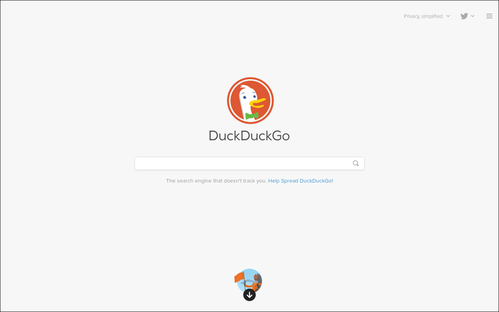
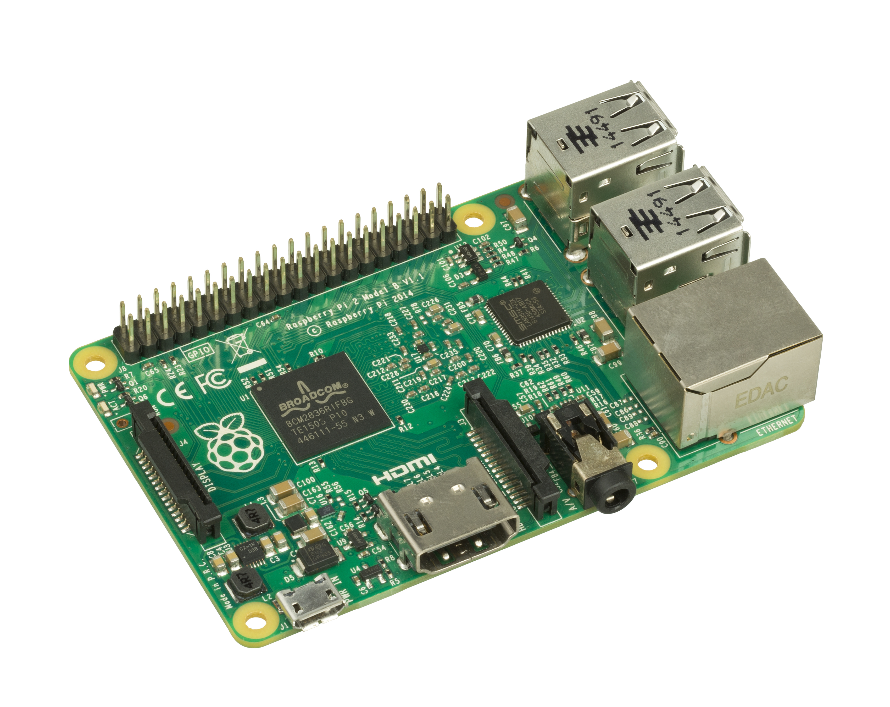
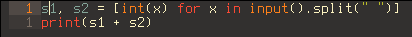
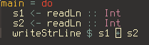
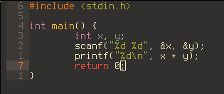
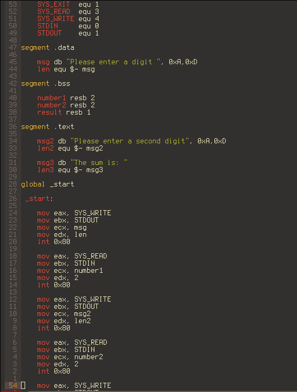
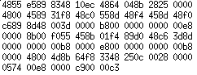

# Datoru uzbūve

Datoru uzbūvi vislabāk ir sākt no programmatūras izstrādes posma. Programmatūru, tai skaitā tādu, ko izmanto izstrādē, dala divos līmeņos - augsta līmeņa un zema līmeņa, kur augsta līmeņa rīkus parasti ir viegli izmantot, savukārt zema līmeņa rīkiem ir nepieciešamas zināšanas par konkrēto lietu, taču tie parasti ir mazāki un ātrāki.

Augsta līmeņa programmēšanas valodas ir tādas valodas, kur nav pārāk jāiedziļinās, lai tās izmantotu. Lietas, kas nodrošina to, lai nav jāiedziļinās mehānikā, sauc par abstrakcijām. Augsta līmeņa valodas vēl var iedalīt sīkāk pēc augstuma pakāpes, kas parasti ir atkarīga no abstrakciju skaita. Piemēram, valodas apmēram sakārtotas pēc augstuma pakāpes dilstošā secībā: JavaScript, Python, Lua, Haskell, F#, OCaml, Clojure, Scheme, Kotlin, Scala, C#, Java, D, Nim, Rust, Zig, C++, C u.t.t. 

Zema līmeņa valodas ir valodas, kur ir ļoti maz vai vispār nav abstrakciju. Tādas valodas ir, piemēram, asamblervalodas, C--. Šīs valodas parasti izmanto, lai būvētu augsta līmeņa valodas vai arī pilnīgai kontrolei pār datoru, piemēram, operētājsistēmu rakstīšanā. Ir arī zema līmeņa valodas, kuras ir izveidotas tāpat vien un kuras parasti neizmanto. Šāda veida valodas sauc par ezotēriskām valodām. Pazīstamākā no šīm valodām ir BF.

Mašīnkods ir pats zemākais līmenis. Tā ir valodu grupa, ko saprot procesori. Populārākās ir: x86, ko izmanto datoros un serveros un atsevišķos telefonos un planšetdatoros; ARM, ko izmanto telefonos, planšetdatoros, maršrutētājos, vienas plates datoros un viedierīcēs; SPARC, kuru izmanto līdzīgās vidēs kā ARM; AVR, megaAVR, Z80, 8052 utt., ko izmanto kā mikrokontrolierus.

Abstrakcijas augsta līmeņa valodās ir divu veidu. Pirmais veids parasti izpaužas tā, ka galvenā programma izsauc funkcijas jeb izpilda komandas. Šīs funkcijas izsauc citas funkcijas, līdz beidzot kāda no funkcijām izsauc otrā veida jeb iebūvētās abstrakcijas. Šīs abstrakcijas iziet caur visām valodām uz kurām programmēšanas valoda balstās, līdz beidzot nonāk līdz mašīnkodam, kur funkciju vietā ir instrukcijas. Instrukcijas izpilda procesors. Lai gan šis process liekas laiku patērējošs, mūsdienu procesoru frekvence ir 1-4 GHz, kas nozīmē, ka tiek izpildītas 1 000 000 000 - 4 000 000 000 instrukciju sekundē.

Daži piemēri, kur programmas mērķis ir saskaitīt divus skaitļus:

Ar instrukcijām var izmantot procesoru un operatīvo atmiņu, taču ar to parasti nepietiek. Lai šo problēmu atrisinātu, procesors rezervē daļu no atmiņas telpas čipsetam. Čipsets ir iekārta, kas sadala šo atmiņu kontrolieriem, kas sadala to citiem kontrolieriem, līdz beidzot tas nonāk pie ierīces. Ierīce izmanto šo atmiņas telpu pēc sava veida. Lai nebūtu problēmas rakstīt programmas, kas izmanto šīs ierīces, tiek izmantoti draiveri - programmas, kas var izmantot šo ierīču rezervētās atmiņas telpas attiecīgi pēc izsauktajām funkcijām. Draiveri ir vajadzīgi arī čipsetiem un kontrolieriem. Vēl ir ierīce, kam nevajag čipsetu - aparātprogrammatūra, kas ir atbildīga par datora ieslēgšanos un izslēgšanos. Ierīces ir arī: skaņas kartes, grafiskās kartes, ievades/izvades kartes, tīklošanas kartes. Kontrolieri ir: USB kontrolieri; SATA un IDE kontrolieri, ar kuriem tiek pieslēgtas krātuves ierīces; PCIe kontrolieri, pie kuriem pieslēdz visu, kas beidzas ar vārdu -karte, kā arī dažas krātuves ierīces.

Atmiņas telpa ir veids, ko sākotnēji izmantoja, lai piekļūtu atmiņai. Tajā atmiņa ir sadalīta 2^n adresēs, kur katra adrese attiecas uz vienu n bitu stāvokli. n ir atkarīgs no procesora bitu skaita - 64 bitu procesorā tas būs 64, 32 bitu - 32, utt. Šo adrešu augšējā daļa ir rezervēta iekārtām. To var izdarīt, jo parasti var pēc adrešu piešķiršanas operatīvajai atmiņai adreses vēl paliek pāri.

Tas tad arī ir viss.

## Piezīmes

1. vislabāk sākt no pr. izstr. posma & divi līmeņi. Attēli
2. augsta/zema līmeņa
3. mašīnkods & attēli
4. abstrakcijas
5. piemēri
6. I/O, kontrolieri, draiveri utt.
7. atmiņas telpa
8. nobeigums
